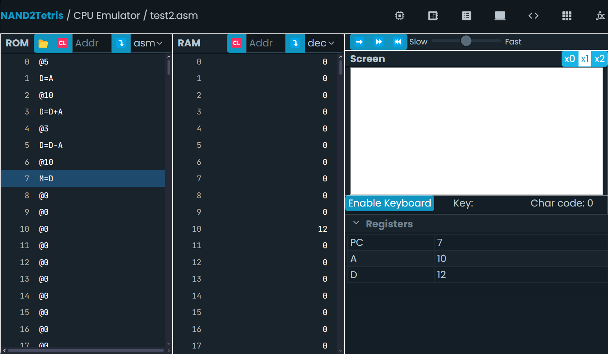

## Solucion a la septima actividad  

### Mi programa en ensamblador Hack:  

``` asm
@5
D=A
@10
D=D+A
@3
D=D-A
@10
M=D
```

### Captura de pantalla del simulador mostrando el estado final de los registros y la memoria:  



**Así se coloca un link a un sitio web**

[Este es un enlacec drive con la imagen](https://drive.google.com/file/d/1WY-GYaKNfSVfrCa9BqyYLji7Hinyg--g/view?usp=sharing)
