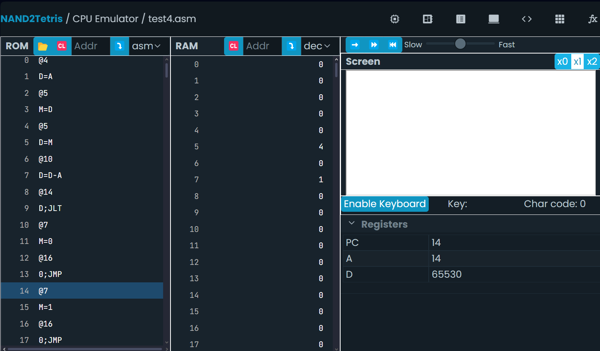
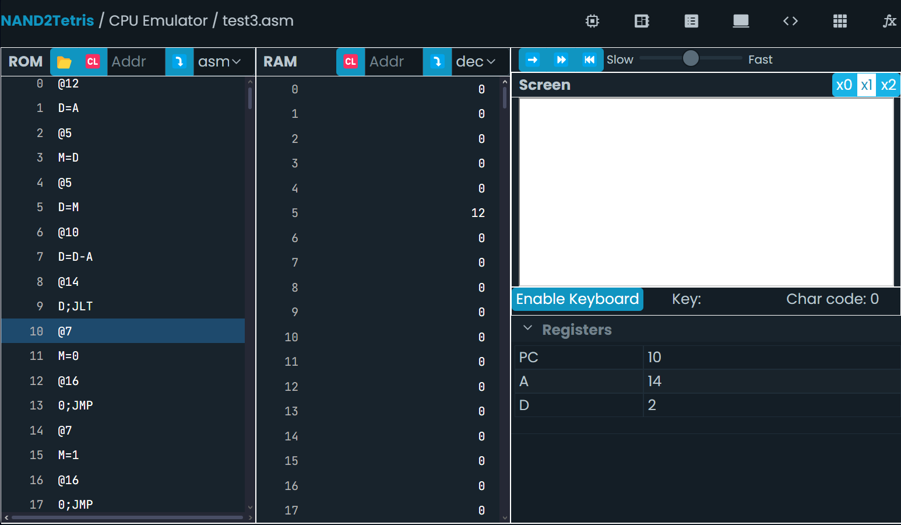

## Solucion a la octava actividad  
### Mi programa en ensamblador Hack:  
#### - Caso 1) Cuando el valor en la dirección 5 es menor que 10:  
```
@4
D=A
@5
M=D
@5
D=M
@10
D=D-A
@SET_ONE
D;JLT       
@7
M=0
@END
0;JMP
(SET_ONE)
@7
M=1
(END)
@END
0;JMP
```
##### Captura de pantalla del simulador mostrando el estado final de los registros y la memoria:  
  
-> [Link a imagen en drive - backup](https://drive.google.com/file/d/1OCgTbIvEimf6RQDrbVgMkFnYb58i_1LF/view?usp=drive_link)
#### - Caso 2) Cuando el valor en la dirección 5 es mayor o igual a 10:  
```
@12
D=A
@5
M=D
@5
D=M
@10
D=D-A
@SET_ONE
D;JLT
@7
M=0
@END
0;JMP
(SET_ONE)
@7
M=1
(END)
@END
0;JMP
```
##### Captura de pantalla del simulador mostrando el estado final de los registros y la memoria:  
  
-> [Link a imagen en drive - backup](https://drive.google.com/file/d/1iDHLiKjCvYq4u6stxhZQ3r4DT67nMYKT/view?usp=drive_link)
