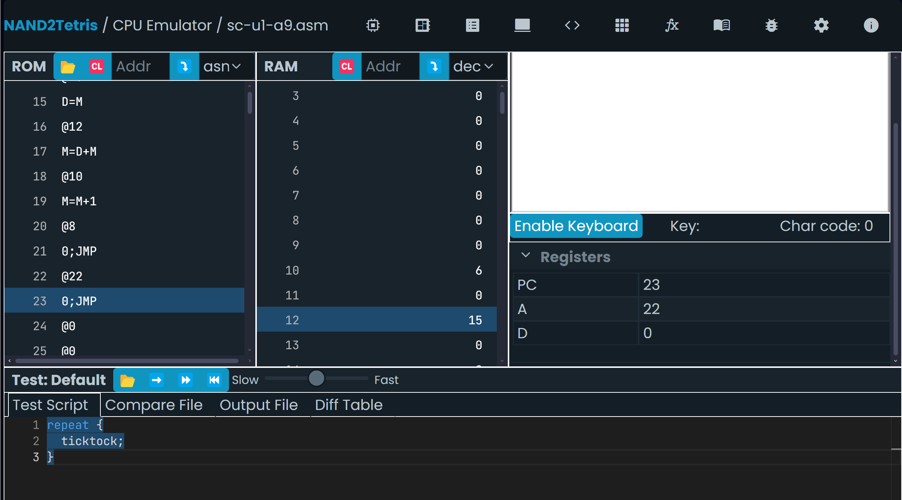

## Solucion a la novena actividad  
### Programa que use un ciclo para sumar los números del 1 al 5 y guarde el resultado en la dirección de memoria 12:
Código asm
```
@1
D=A
@10
M=D

@0
D=A
@12
M=D

(LOOP)
@10
D=M

@6
D=D-A
@END
D;JGE

@10
D=M
@12
M=D+M

@10
M=M+1

@LOOP
0;JMP   

(END)
@END
0;JMP
```
### Captura de pantalla del simulador: 
  
