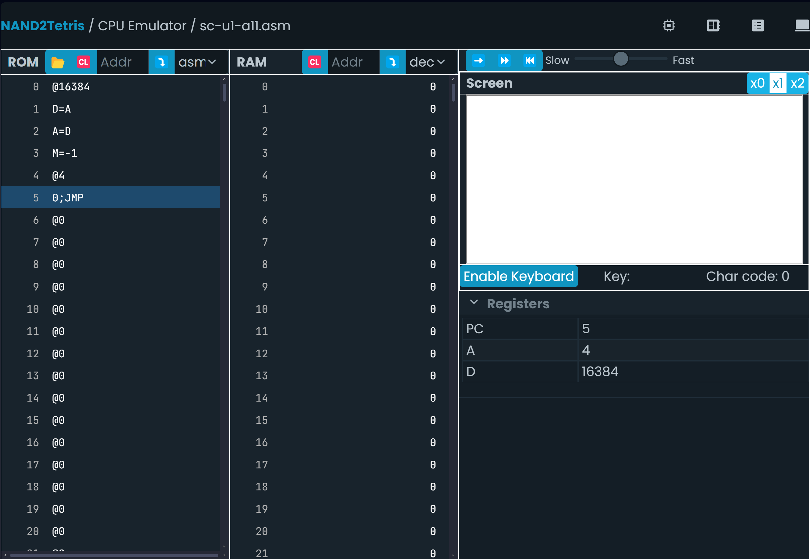

## Solucion a la onceava actividad  
### Programa que dibuje un punto enla esquina superior izquierda de la pantalla
Código asm
```
@SCREEN
D=A
A=D
M=-1
(END)
@END
0;JMP
```
### Captura de pantalla del simulador: 
  
