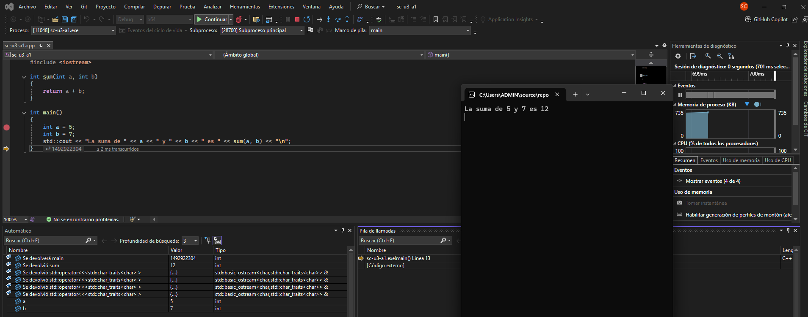

## Solución a la primer actividad
  
- **Stop (_cuadrado rojo_):**  Detiene la ejecución del programa en cualquier momento.
    - **Ejemplo:** Estás ejecutando paso a paso y te das cuenta de que el código entró en un bucle infinito, o simplemente has terminado de analizar lo que necesitabas. Presionas Stop y regresas al editor con la ejecución detenida.
- **Restart (_flecha circular_):** Permite comenzar la depuración de nuevo sin tener que detener la ejecución y luego darle a “Start” otra vez.
    - **Ejemplo:** Descubriste un problema en tu código y lo corregiste. Ahora quieres verificar desde cero. En lugar de detener y volver a iniciar, presionas “Restart” y Visual Studio vuelve a compilar (si es necesario)
 y a ejecutar el programa desde el inicio.
- **Continue (_flecha hacia la derecha_):** Cuando pausas el programa en un punto de quiebre y quieres dejar que corra hasta el siguiente breakpoint sin ir paso a paso, usas “Continue”.
    - **Ejemplo:** Tienes un breakpoint en la línea ```int a = 5```; y otro en ```int b = 7```;. Al llegar al primero, si presionamos “Continue”, la ejecución avanzará directamente hasta el breakpoint en b.
- **Step Over (_flecha hacia abajo_, F10):** Ejecuta la siguiente instrucción, pero si encuentra una llamada a función, la ejecuta completa y no entra en la implementación de la función.
    - **Ejemplo:** Tienes el código:
      ``` cpp
        int resultado = sum(a, b); // sum es una función
        std::cout << resultado << std::endl; 
      ```
        Si en este punto presionas “Step Over” estando en la línea ```int resultado = sum(a, b)```;, el depurador ejecutará toda la función ```sum(a, b)``` internamente y el siguiente paso te mostrará el cursor en la línea ```std::cout << resultado << std::endl```;.
- **Step Into (_flecha curva hacia abajo_, F11):** Ejecuta la siguiente instrucción y, si esa instrucción es una llamada a función, ingresa dentro de la función para depurarla línea a línea.
    - **Ejemplo:** Con el mismo código de arriba:
      ``` cpp
        int resultado = sum(a, b);
      ```
        Si presionas “Step Into” al llegar a esta línea, entrarás al cuerpo de la función ```sum(int a, int b)``` y podrás ver cómo se ejecuta la instrucción return a + b;.
- **Step Out (_flecha hacia arriba_, shift+F11):** Si ya entraste en una función y no quieres seguir revisando línea a línea su interior, “Step Out” ejecuta el resto de la función y vuelve a la línea siguiente en la función llamante.
    - **Ejemplo:** Estás dentro de la función ```sum(a, b)```, línea por línea, pero te das cuenta de que no hay nada más que analizar. Presionas “Step Out” y el depurador sale de sum y te coloca en la línea que sigue después de la llamada ```sum(a, b)``` en main.
