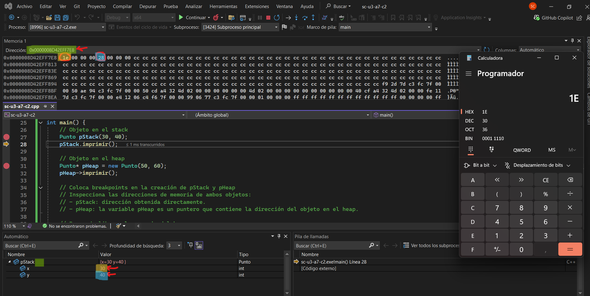
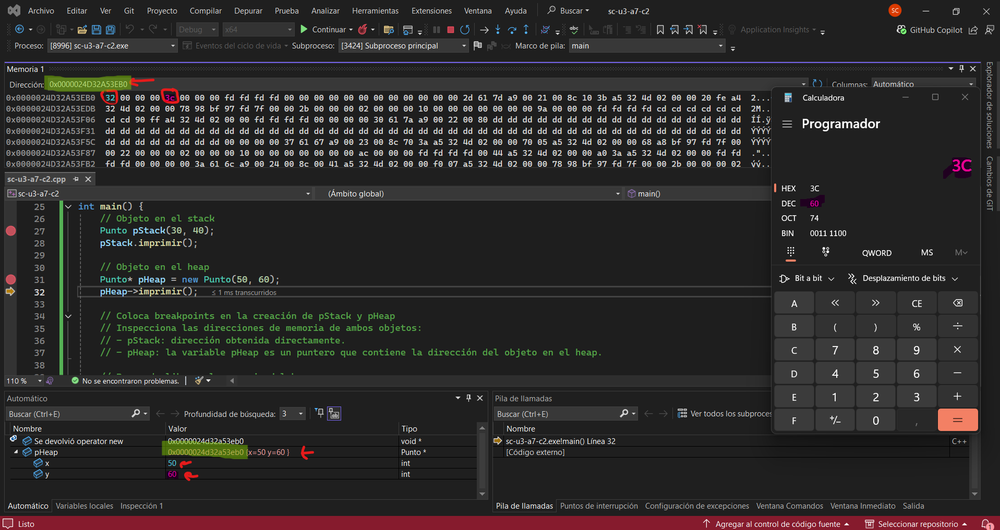

## Solución a la octava actividad
### Captura de pantalla del depurador mostrando ambas direcciones de memoria: 
Para pStack:
  
Para pHeap:
  
### Explicación de la diferencia entre objetos creados en el stack y en el heap:
- Los objetos del stack se crean y se destruyen automáticamente cuando entran y salen del ámbito (por ejemplo, cuando una función termina). Su tiempo de vida es automático y limitado al ámbito en que se crean.
- Los objetos del heap se crean dinámicamente usando new, y deben liberarse manualmente con delete. Esto significa que permanecen activos en la memoria hasta que se liberen explícitamente, permitiendo un tiempo de vida más flexible.
- Objetos en el stack suelen tener direcciones de memoria relativamente altas y cercanas entre sí.
- Objetos en el heap tienen direcciones diferentes, generalmente en regiones más alejadas del stack, y no necesariamente cercanas unas a otras.
### ```pStack``` ¿Es un objeto o una referencia a un objeto?
En este caso ```pStack``` es directamente un objeto creado en el stack, ocupando directamente su espacio en memoria, no una referencia.
### ```pHeap``` ¿Es un objeto o una referencia a un objeto? Si es una referencia, ¿A qué objeto hace referencia?
En este caso, ```pHeap``` es un puntero a un objeto que está ubicado en el heap. ```pHeap``` en sí no es el objeto, sino un puntero que almacena la dirección de memoria del objeto que creaste dinámicamente con ```new Punto(50, 60)```.
### Observa en Memory1 (Debug->Windows->Memory->Memory1) el contenido de la dirección de memoria de pHeap, recuerda escribir en la entrada de texto de Memory1 la dirección de memoria de &pHeap y presionar Enter. Compara el contenido de memoria con el contenido de pHeap en la pestaña de Locals (Debug->Windows->Locals). ¿Qué observas? ¿Qué significa esto?   
Cuando abrí la pestaña Memory1 y escribí la dirección de &pHeap, pude ver que el contenido en esa dirección era otra dirección en hexadecimal: la dirección exacta del objeto que había creado en el heap con new. Luego, al mirar en la pestaña Locals, confirmé que pHeap guardaba ese mismo valor: la dirección del objeto en memoria dinámica. Eso me hizo entender que pHeap en realidad no es el objeto en sí, sino un puntero, o sea, una variable que almacena la dirección de otro objeto. No tiene los valores de x e y directamente, sino que simplemente apunta al lugar donde están almacenados en el heap. Me quedó clarísimo que, para acceder a esos valores, necesito seguir esa dirección.
